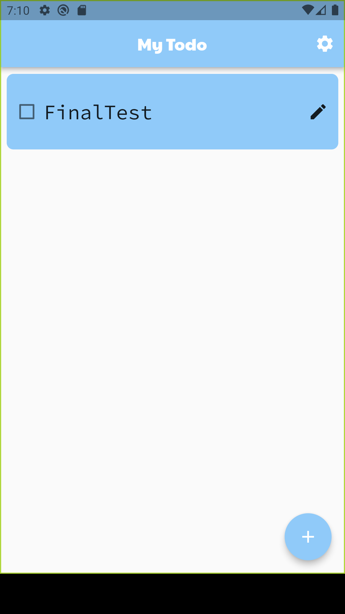
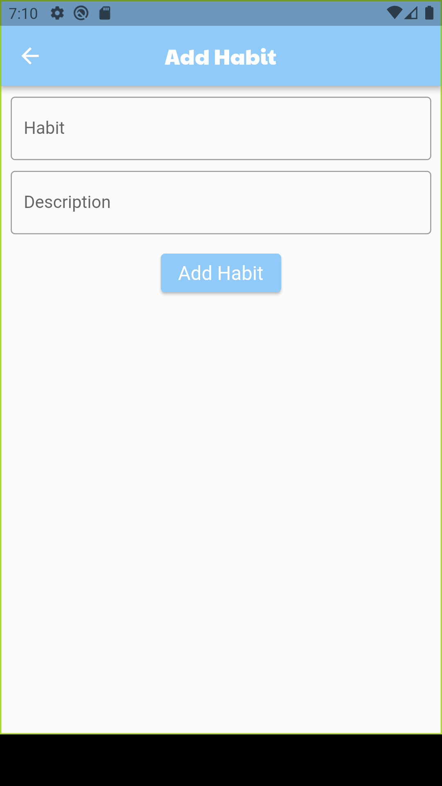
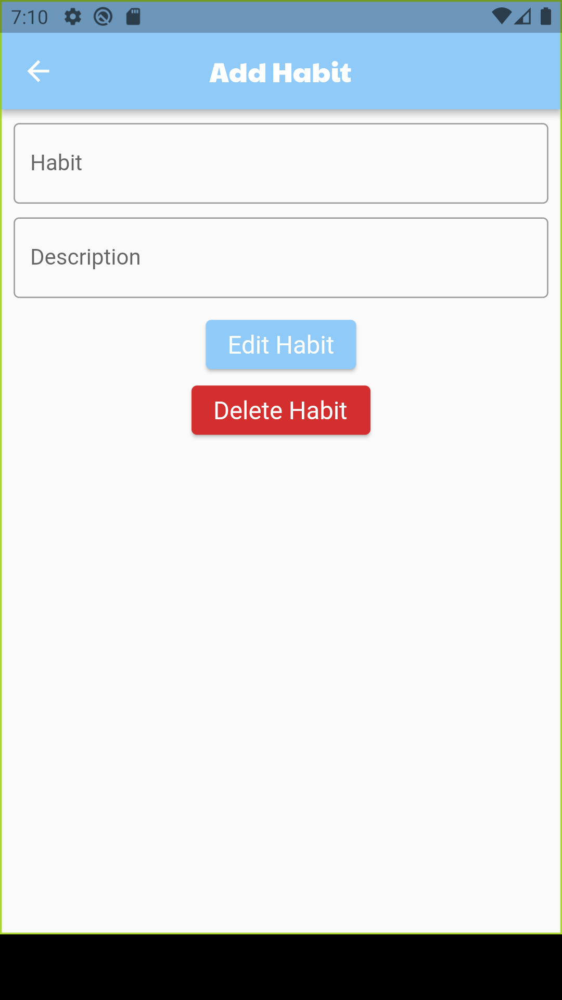
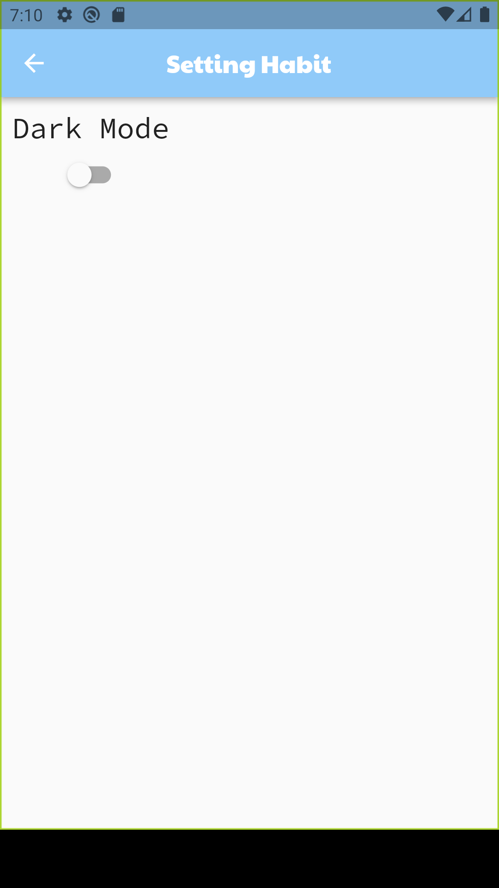
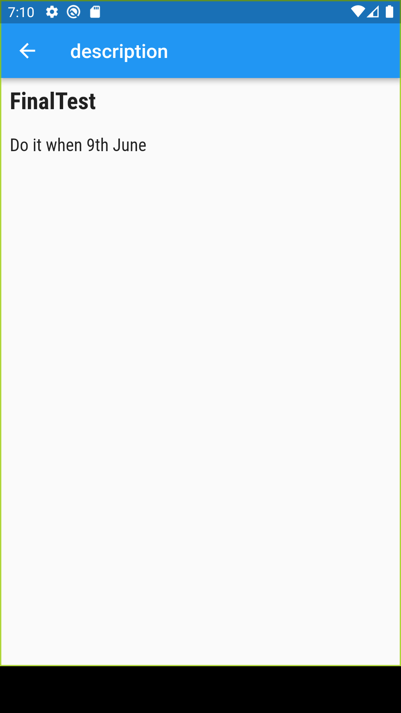

# high_finalteste

## 개요

flutter을 기반으로 제작한 Todo 앱

## 사용 패키지 및 api

### Package

1. google_fonts: ^5.0.0 : 텍스트 폰트를 구글 폰트에서 폰트들을 사용 가능하게 해준다.
2. http: ^1.0.0 : http api get을 사용 가능하게 한다.
3. firebase_core: ^2.13.1 : firebase 데이터베이스 api를 사용 가능하게 해준다.
4. cloud_firestore: ^4.8.0 : firebase firestore database를 사용 가능하게 해준다.
5. fluttertoast: ^8.2.2 : flutter toast message를 사용 가능하게 해준다.
6. flutter_native_splash: ^2.3.1 : flutter splash 화면을 사용 가능하게 해준다.

### Api

1. https://api.adviceslip.com/advice : 랜덤 명언 api(영어)

## 페이지 설명

### 메인 페이지

추가한 todo 리스트를 확인할 수 있는 페이지이다.

### 추가 페이지

todo를 추가 할 수 있는 페이지이다.

### 수정 페이지

todo를 수정하거나 삭제 할 수 있는 페이지이다.

### 옵션 페이지

앱의 설정을 변경 할 수 잇는 페이지이다.

### 상세 페이지

todo의 상세 설명을 볼 수 있는 사이트이다.

## 참고사이트

firestore crud : https://www.youtube.com/watch?v=-_G7Gvo7muM&list=PL9n0l8rSshSnSO4dNTJmKGNa0VNHrCQFR&index=9

OpenApi : https://dev-yakuza.posstree.com/ko/flutter/http/

dark mode : https://www.youtube.com/watch?v=3GwV7bn6NLk
